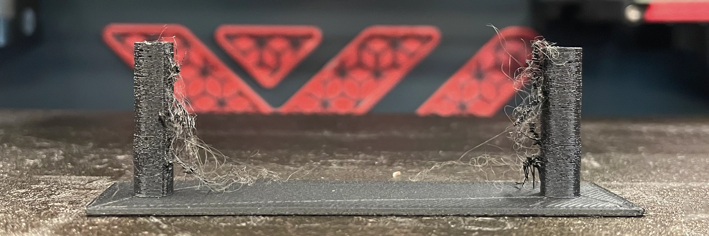
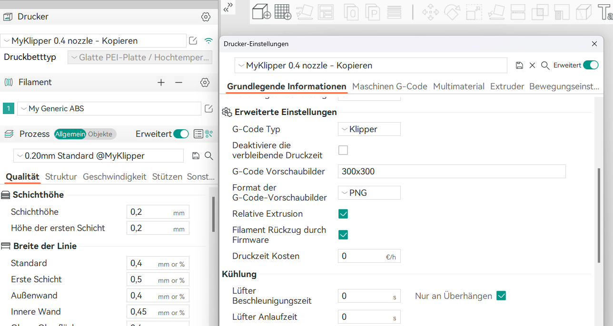

<script setup>
import FWRetractCalibrationCalculator from '../../components/FWRetractCalibrationCalculator.vue'
</script>

# Firmware Retraction kalibrieren

Klipper bietet die Möglichkeit zur [Firmware Retraction](https://www.klipper3d.org/Config_Reference.html?h=retract#firmware_retraction) über `G10` an. So müssen die Werte nicht mehr hauptsächlich im Slicer angegeben werden, außer das Filament benötigt gesonderte Einstellungen.



## Aktivieren in der Konfiguration
Zuvor muss `[firmware_retraction]` in der `printer.cfg` aktiviert werden.  
```
[firmware_retraction]
retract_length: 1
retract_speed: 20
unretract_extra_length: 0
unretract_speed: 10
```
::: warning
Dies sind Beispielwerte.
:::

## Stringing Test Modell
Es kann folgendes Modell verwendet werden:  
[Klipper stringing test with firmware retraction](https://www.printables.com/model/236366-klipper-stringing-test-with-firmware-retraction) auf printables.  

## Slicer Einstellungen
Slice das Modell mit Standardeinstellungen 2 Perimter und 0 Inflill ist okay.  
Stelle sicher dass dein Slicer auf Firmware Retraction eingestellt ist.  
Hier am Beispiel von Orca Slicer:
  
Im gcode-File solltest du nun, an den Stellen, an denen Retraction ausgeführt wird, `G10` und `G11` Angaben finden.

Bevor das Modell gedruckt wird, gib folgendes in die Kommandozeile unter Fluidd/Mainsail ein.  
`TUNING_TOWER COMMAND=SET_RETRACTION PARAMETER=RETRACT_LENGTH START=0 FACTOR=0.05`  
`START` entspricht dem Startwert, mit wieviel Retraction gestartet werden soll.  
`FACTOR` entspricht dem Steigerungswert.  

## Wert ermitteln
Miss das Modell von der Unterseite bis zu der Stelle, an der das Stringing weg ist.
Dabei wird folgende Formel verwendet. `retraction = (start + measured_height) * factor`  

## Berechnen
<FWRetractCalibrationCalculator />

