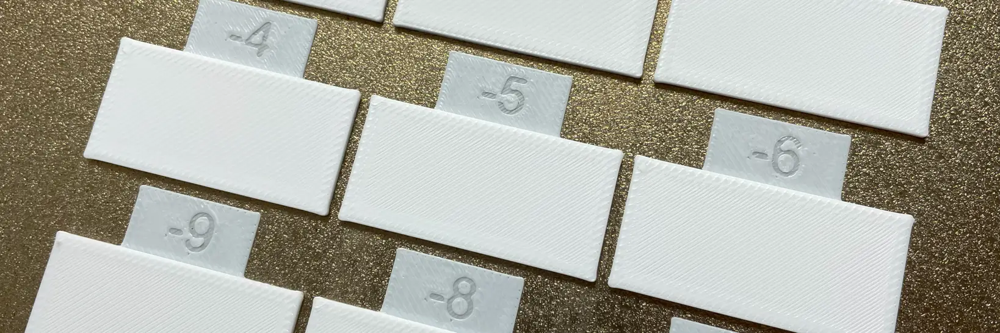

# Orca Slicer Flow Kalibrierung
Berechnet den Flow-Wert anhand der [Kalibrierungstools von Orca Slicer](https://github.com/SoftFever/OrcaSlicer/wiki/Calibration#flow-rate).  

## Wert ermitteln
Dabei wird die Formel `Flow = FlowRatio_old * (100 + modifier) / 100` verwendet.  
`FlowRatio_old` entspricht dem aktuell eingestellten Flow.  
`modifier` entspricht dem Wert auf dem Sample, an dem der Flow am besten aussieht.  

## Berechnen
<FlowCalibrationCalculator />

