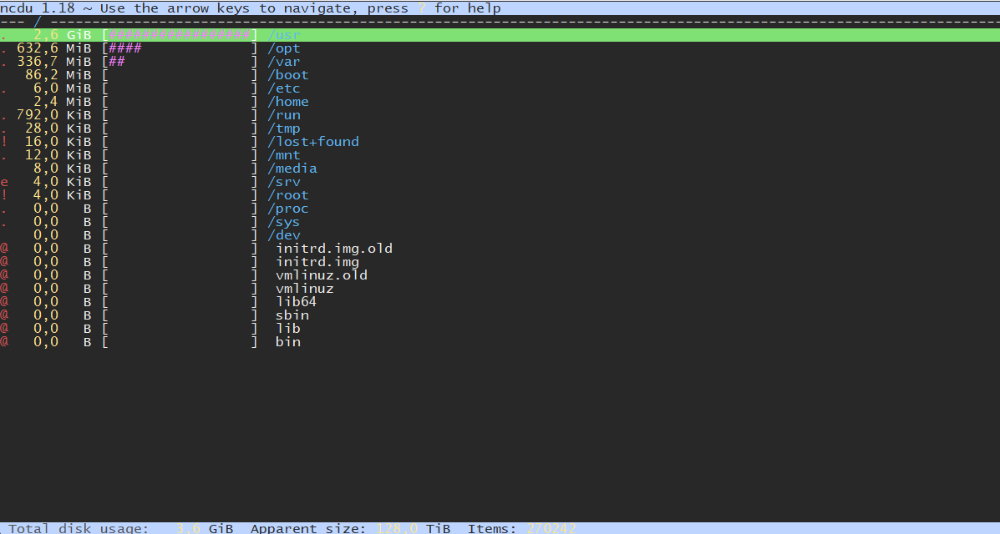

# Tipps und Tricks
Alles was ich als nützlich empfinde.  
Ich verwende i.d.R. Debian, weshalb die Tipps definitiv hierfür funktionieren sollten.

## Cleanup /var/log/journal

In `/var/log/journal/` liegen die Journalprotokolle, die von systemd generiert werden. Diese können in der Standardkonfiguration enorm anwachsen.  
Über `du -h /var/log/journal` kannst du sehen, wie groß der Ordner bereits ist.  
Alternativ geht auch ein ```sudo journalctl --disk-usage```, diesen muss aber als root ausgeführt werden, damit alle berücksichtigt werden.  
  
Du kannst mit `sudo journalctl --vacuum-size=100M` das Journal auf die letzten 100MB herunterkürzen.  
Mit `sudo journalctl --vacuum-time=10d` alle Einträge die älter als 100 Tage sind.  
  
In der `/etc/systemd/journald.conf` kannst du nach den Einträgen `SystemMaxUse=` und 
`SystemMaxFileSize=` suchen. Kommentiere diese aus und stelle sie bspw. auf:
```
SystemMaxUse=500M
SystemMaxFileSize=100M
```
::: tip
Der erste Wert legt die maximal genutzte Größe auf der Festplatte fest. Der zweite Wert bestimmt dabei, die maximale Größe einer einzelnen Datei.
:::

Danach noch ein `service systemd-journald restart`, damit der Dienst neugestartet wird. Von nun an, wächst das Journal nicht mehr über die 100MB hinaus.

## Große Dateien auffinden

Installiere hierzu [ncdu](https://dev.yorhel.nl/ncdu).
> Ncdu ist ein Festplattennutzungsanalysator mit einer Ncurses-Schnittstelle. Es wurde entwickelt, um Platzfresser auf einem Remote-Server zu finden, auf dem Sie kein vollständiges grafisches Setup zur Verfügung haben, aber es ist auch auf normalen Desktop-Systemen ein nützliches Tool.

```shell
sudo apt udpade
sudo apt install ncdu
```
Danach führst du einfach `ncdu /` in der Kommandozeile aus.

Mit den Pfeiltasten und Enter wird durch das Menü navigiert.  
